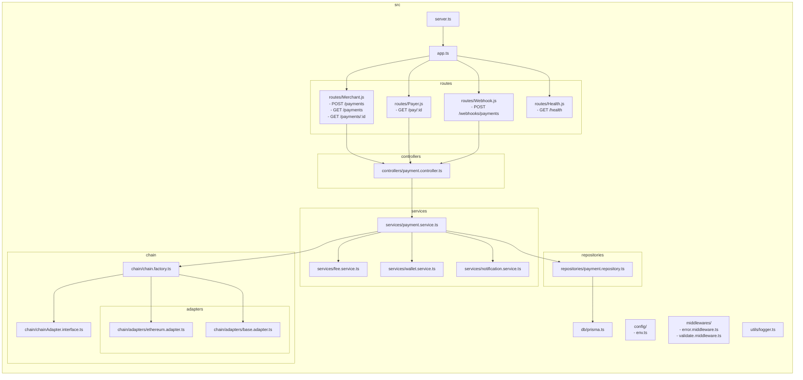

# ZapPay

A modern cryptocurrency payment application built with React and TypeScript.

## Features

- **Multi-Crypto Support**: Accept payments in USDC, USDT, and ETH
- **Multiple Networks**: Support for Base and Ethereum mainnet
- **QR Code Generation**: Easy payment request sharing via QR codes
- **Fast & Lightweight**: Built with Vite for optimal performance
- **Type-Safe**: Full TypeScript support for reliable development

## Tech Stack

- **Frontend**: React 19 + TypeScript
- **Build Tool**: Vite
- **Routing**: React Router v7
- **UI Icons**: Lucide React
- **QR Codes**: qrcode.react
- **Linting**: ESLint

## Getting Started

### Prerequisites
- Node.js 16+ and npm

### Installation

```bash
# Install dependencies
npm install
```

### Development

```bash
# Start development server
npm run dev
```

The app will be available at `http://localhost:5173`

### Build

```bash
# Build for production
npm run build
```

### Lint

```bash
# Check code quality
npm run lint
```

### Preview

```bash
# Preview production build locally
npm run preview
```

## Project Structure

```
src/
├── components/     # Reusable React components
├── pages/          # Page components (Home, PayFlow)
├── data/           # Mock data and utilities
├── types/          # TypeScript type definitions
├── App.tsx         # Main app component
└── main.tsx        # Application entry point
```

## Routes

- `/` - Home page with payment options
- `/pay/:id` - Payment flow for specific transaction

## Flow




## License

MIT